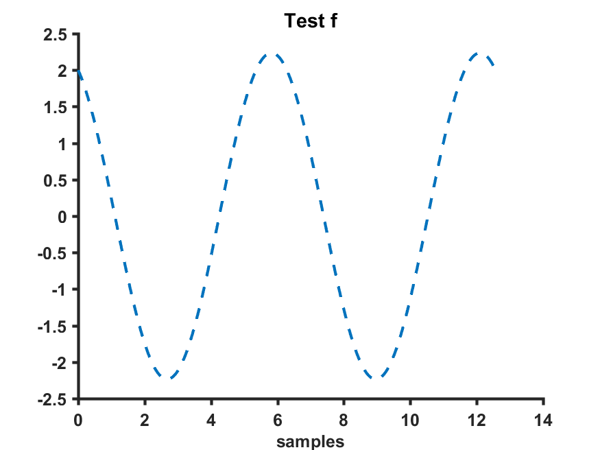
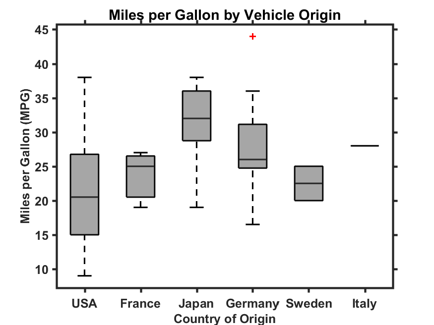

# matlab_plot_tools
Matlab functions for scientific paper quality matlab plots. The function can be used instead of the classic Matlab function, like plot() or boxplot() to have a more aesthetically pleasant result.

## Available Functions

```
plot_me
```



```
boxplot_me
```



